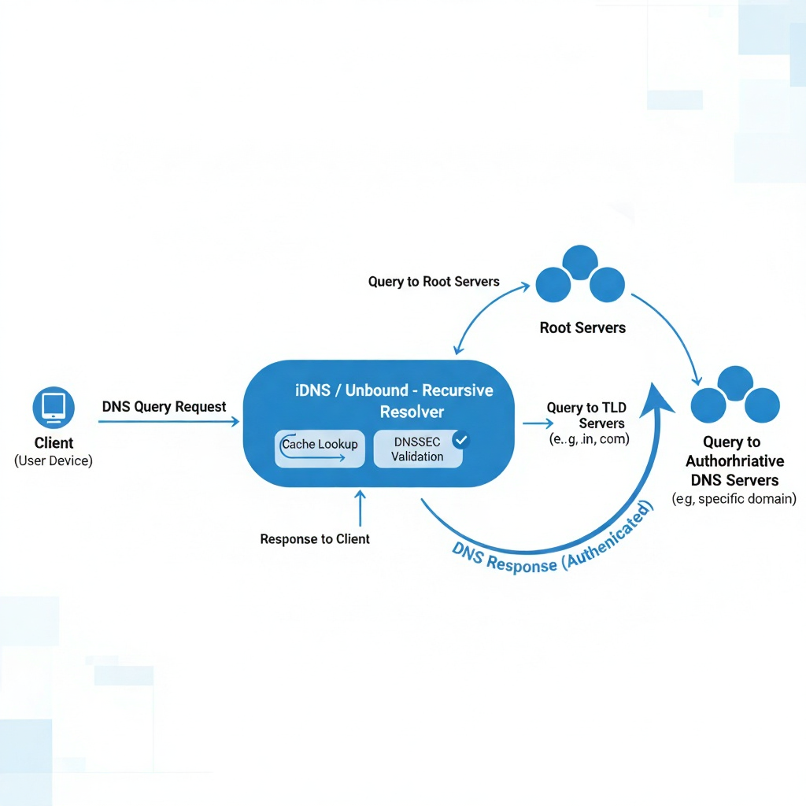

# 🌍 iDNS – Research Project on Secure DNS Resolution  

A research-driven exploration into improving DNS resolution reliability and security.  
Developed as part of **AIORI Phase I** under the *India Internet Foundation*.  

---

### ⚙️ Overview
iDNS focuses on understanding and improving:
- DNS cache optimization  
- Query performance  
- DNSSEC validation and integrity  
- Security-focused resolver configuration  

This public repository contains **only conceptual and educational content**.  
All experimental configurations, scripts, and datasets remain private for security and compliance reasons.  

---

### 🧠 Learning Focus
- Basics of DNS architecture and resolution  
- Cache performance analysis principles  
- DNSSEC and secure lookups  
- Research documentation and system visualization  

---

### 📘 Repository Structure
| Folder | Description |
|:--|:--|
| `docs/` | Safe documentation and research summaries |
| `results/` | Example visualizations and public benchmark figures |
| `assets/` | Architecture and process diagrams |

---

### 🖼️ Visual Overview
  

*(Conceptual diagram showing the logical flow of DNS resolution in iDNS)*  

---

### 📚 Related Projects
This repository is part of my **AIORI** focused on *Cybersecurity & Network Security*.  
Explore related modules:  

- 🔐 [Web Security Scanner](https://github.com/Jigisha-Diksha/Web-Security-Scanner)  
- ⚙️ [Accident Alert IoT System](https://github.com/Jigisha-Diksha/Accident-Alert-IoT-System)  
- 🌐 [Event Portal – Aarambh](https://github.com/Jigisha-Diksha/Event-Portal-Aarambh)  

🧩 *Sensitive configurations and implementation files are intentionally excluded for confidentiality.*  

---

⭐ *Exploring the intersection of DNS performance, security, and system design.*
